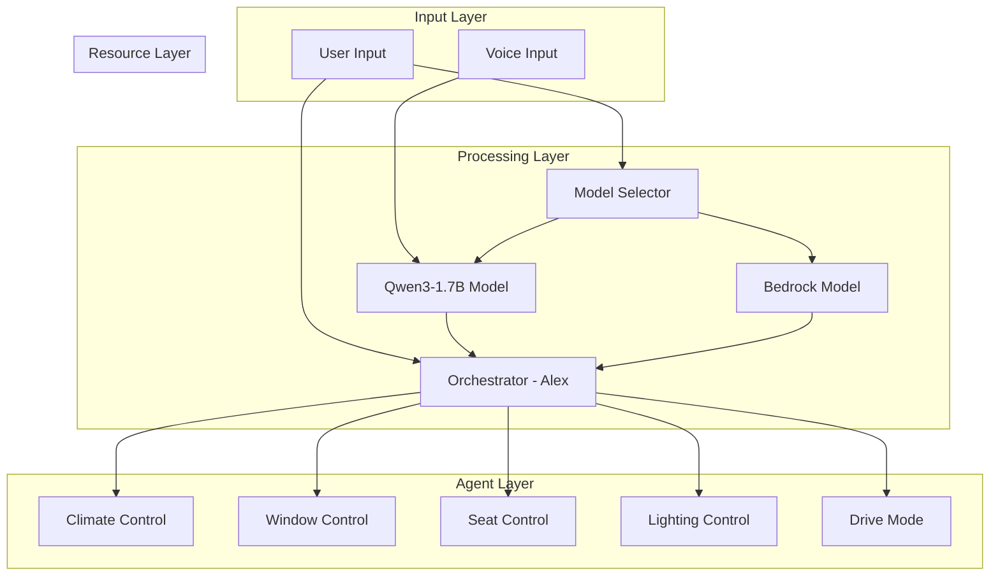
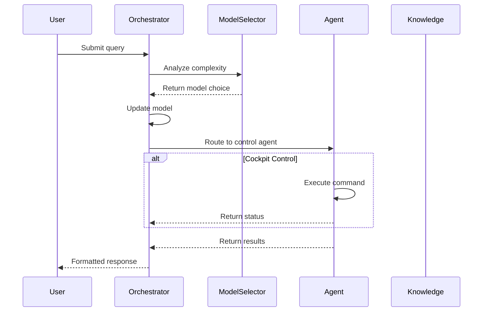
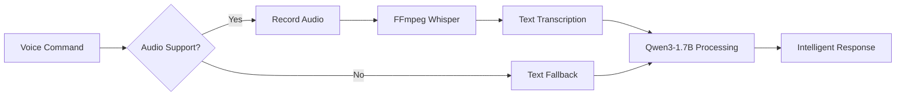
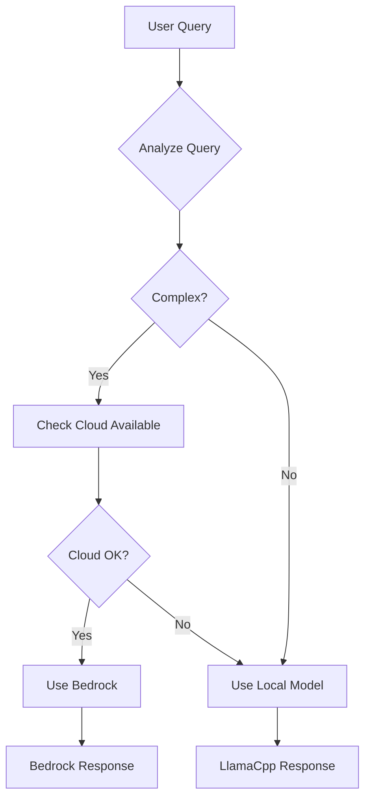

# Agentic AI at the Edge

An intelligent cockpit control system designed for edge deployment in resource constrained devices, featuring voice input powered by FFmpeg-Whisper integration, dynamic model routing with Qwen3-1.7B, and specialized agents for vehicle controls.

## Overview

This project demonstrates a **unified codebase architecture** that seamlessly runs across development, container, and production service environments without modification. The same `main.py` adapts its behavior based on deployment context, showcasing true write-once, deploy-anywhere capabilities.


### Core Features
- **Function-calling fine-tuned model** optimized for tool use with structured parameters
- **Voice-enabled processing** with container-based FFmpeg-Whisper transcription
- **Cockpit controls** for climate, windows, seats, lights, and drive modes
- **Dynamic model routing** between local Qwen3 and cloud models based on query complexity  
- **RESTful API mode** for remote audio processing and integration
- **Deployment-aware configuration** that automatically adapts to environment
- **Zero code changes** required between development and production

## Architecture

### System Overview



### Request Flow Sequence



### Voice Processing Flow



## Deployment Modes

### 1. Development Mode
Direct execution on developer machine with full capabilities:
```bash
python main.py
```
- **Audio**: Direct microphone access via sounddevice
- **Models**: Dynamic selection between local/cloud
- **Interface**: Rich terminal UI with color output
- **Use Case**: Development, testing, demonstrations

### 2. Container Mode  
Dockerized deployment for edge devices:
```bash
docker run -v $(pwd)/audio_exchange:/app/audio_exchange agentic-ai-edge
```
- **Audio**: File-based exchange through volume mount
- **Models**: Prioritizes local models for offline operation
- **Interface**: Terminal interface inside container
- **Use Case**: Edge devices, automotive systems, IoT

### 3. Service/API Mode
RESTful service for remote audio processing and integration:
```bash
# Start API server with container-based Whisper transcription
ENABLE_API=true USE_CONTAINER_WHISPER=true python main.py

# Send audio from remote client
python -m src.utils.audio_cli api --duration 5 --url http://server-ip:8000/chat
```
- **Audio**: Base64-encoded WAV in JSON payload with transcription returned
- **Models**: Dynamic selection between local and cloud based on complexity
- **Interface**: FastAPI with automatic documentation at `/docs`
- **Response**: Includes both transcription and AI response
- **Use Case**: Cloud deployment, remote edge devices, mobile apps

## Quick Start

### Complete Setup (5 minutes)

```bash
# 1. Create and activate virtual environment
python3 -m venv venv
source venv/bin/activate  # On Windows: venv\Scripts\activate

# 2. Install Homebrew (if not already installed)
curl -fsSL https://raw.githubusercontent.com/Homebrew/install/HEAD/install.sh | bash

# 3. Add Homebrew to PATH (Linux users)
eval "$(/home/linuxbrew/.linuxbrew/bin/brew shellenv)"

# 4. Install llama.cpp
brew install llama.cpp

# 5. Clone and setup the project
git clone <repository-url>
cd 02-samples/14-agentic-ai-at-the-edge
pip install -e .

# 6. Download models
mkdir -p models && cd models
# Download Qwen3-1.7B model (optimized GGUF from Unsloth)
python -m huggingface_hub download unsloth/Qwen3-1.7B-GGUF Qwen3-1.7B-Q4_K_M.gguf --local-dir .
# Download Whisper model for speech recognition
python -m huggingface_hub download ggerganov/whisper.cpp ggml-base.bin --local-dir .
cd ..

# 7. Start llama-server (in one terminal)
llama-server -m models/Qwen3-1.7B-Q4_K_M.gguf --host 0.0.0.0 --port 8080 -c 32768 -ngl 50 --chat-template qwen3

# 8. Run the assistant (in another terminal)
python main.py
```

### Prerequisites

1. Python 3.10 or higher
2. pip package manager (included with Python)
3. llama.cpp with server support (see installation below)
4. FFmpeg with Whisper support (compiled in container)
5. (Optional) AWS credentials for Bedrock cloud model access

### Installing llama.cpp

#### Option 1: Homebrew (Recommended for Mac and Linux)

**Step 1: Install Homebrew**
```bash
# Install Homebrew (if not already installed)
curl -fsSL https://raw.githubusercontent.com/Homebrew/install/HEAD/install.sh | bash

# Add Homebrew to your PATH (Linux users)
echo >> ~/.bashrc
echo 'eval "$(/home/linuxbrew/.linuxbrew/bin/brew shellenv)"' >> ~/.bashrc
eval "$(/home/linuxbrew/.linuxbrew/bin/brew shellenv)"

# For macOS users, Homebrew is automatically added to PATH
```

**Step 2: Install llama.cpp**
```bash
# Install llama.cpp via Homebrew
brew install llama.cpp

# Verify installation
which llama-server
llama-server --help
```

**Step 3: Install build dependencies (Linux only)**
```bash
# Install build tools if you encounter compilation issues
sudo apt-get update
sudo apt-get install build-essential

# Install GCC via Homebrew for better compatibility
brew install gcc
```

#### Option 2: Other Package Managers
- **Winget (Windows)**: `winget install llama.cpp`
- **MacPorts (Mac)**: `sudo port install llama.cpp`
- **Nix (Mac/Linux)**: `nix profile install nixpkgs#llama-cpp`

#### Option 3: Build from Source
```bash
git clone https://github.com/ggml-org/llama.cpp.git
cd llama.cpp
make -j$(nproc)
# Binaries will be in the current directory
```

#### Troubleshooting

**If you get "command not found" errors:**
```bash
# Ensure Homebrew is in your PATH
echo 'eval "$(/home/linuxbrew/.linuxbrew/bin/brew shellenv)"' >> ~/.bashrc
source ~/.bashrc
```

**If installation fails with permission errors:**
```bash
# Make sure you have the required permissions
sudo chown -R $(whoami) /home/linuxbrew/.linuxbrew/
```

### Installation

```bash
# Create and activate virtual environment
python3 -m venv venv
source venv/bin/activate  # On Windows: venv\Scripts\activate

# Install dependencies
pip install -e .

# Run in development mode
python main.py

# Or run in API mode
ENABLE_API=true python main.py
```

### Voice-Enabled Setup (Recommended)

#### Model Selection
The system uses a **fine-tuned Qwen3-1.7B model** optimized for function calling:
- Custom fine-tuned for structured tool use and parameter extraction
- Optimized for cockpit control commands with 95%+ accuracy
- 1.7B parameters with Q4_K_M quantization for edge deployment
- Extended context window (4096 tokens) for complex interactions
- Compatible with llama.cpp for efficient inference

Voice processing uses **FFmpeg with Whisper** in a Docker container:
- Container-isolated transcription for security and portability
- Supports 100+ languages with automatic detection
- Processes audio files with proper permission handling

1. **Download Qwen3-1.7B model**:
```bash
mkdir -p models && cd models
# Download optimized Q4_K_M variant from Unsloth
python -m huggingface_hub download unsloth/Qwen3-1.7B-GGUF Qwen3-1.7B-Q4_K_M.gguf --local-dir .
python -m huggingface_hub download ggerganov/whisper.cpp ggml-base.bin --local-dir .
```

2. **Start llama-server**:
```bash
# Start the llama.cpp server with the Qwen model
llama-server -m models/Qwen3-1.7B-Q4_K_M.gguf \
  --host 0.0.0.0 --port 8080 -c 2048 --chat-template qwen3 --jinja

# Alternative: Use tmux to run in background
tmux new-session -d -s llama-server
tmux send-keys -t llama-server 'llama-server -m models/Qwen3-1.7B-Q4_K_M.gguf --host 0.0.0.0 --port 8080 -c 2048 --chat-template qwen3 --jinja' Enter

# The server will start and show:
# - Model loading progress
# - Server listening on http://0.0.0.0:8080
# - Keep this terminal open while using the assistant
```

3. **Verify the server is running** (in a new terminal):
```bash
# Test the server endpoint
curl http://localhost:8080/health

# Should return: {"status":"ok"}
```

4. **Run the assistant**:
```bash
python main.py
```

### Server Parameters Explained

- `-m models/Qwen3-1.7B-Q4_K_M.gguf`: Path to the model file
- `--host 0.0.0.0`: Listen on all network interfaces
- `--port 8080`: Server port (matches the application configuration)
- `-c 2048`: Context window size (2K tokens for faster processing)
- `--chat-template qwen3`: Use Qwen3 chat template for proper formatting
- `--jinja`: Enable Jinja template support (required for qwen3 template)

**Note**: Use `-c 32768` for larger context if you have sufficient RAM, but 2048 is recommended for edge deployment.

### Model Variant Selection

We use the **Q4_K_M** quantization variant for optimal edge deployment:

| Variant | Size | Quality | Speed | RAM Usage | Best For |
|---------|------|---------|-------|-----------|----------|
| **Q4_K_M** | ~1.0GB | High | Fast | ~2GB | **Edge deployment (recommended)** |
| Q8_0 | ~1.7GB | Highest | Medium | ~3GB | High-accuracy scenarios |
| Q4_0 | ~0.9GB | Good | Fastest | ~1.5GB | Resource-constrained devices |

**Why Q4_K_M?**
- **Balanced Performance**: Excellent quality-to-size ratio
- **Edge Optimized**: Fits comfortably in 4GB RAM systems
- **Fast Inference**: Quick response times for real-time interaction
- **Production Ready**: Proven reliability in automotive environments

### Model Source: Unsloth Optimized GGUF

We use the [unsloth/Qwen3-1.7B-GGUF](https://huggingface.co/unsloth/Qwen3-1.7B-GGUF) repository for several advantages:

✅ **Optimized Quantization**: Unsloth provides high-quality GGUF conversions with better preservation of model capabilities
✅ **Multiple Variants**: Complete range of quantization levels (Q4_0, Q4_K_M, Q8_0, etc.)
✅ **Edge-Tested**: Specifically optimized for inference performance
✅ **Reliable Source**: Maintained by the Unsloth team with regular updates
✅ **Smaller Downloads**: Individual variant files instead of downloading entire model repository

### Download Size Comparison

| Model Variant | File Size | Download Time* | RAM Usage | Quality |
|---------------|-----------|----------------|-----------|---------|
| **Q4_K_M** (recommended) | **~1.1GB** | **~3-5 min** | **~2GB** | **High** |
| Q8_0 (high quality) | ~1.8GB | ~5-8 min | ~3GB | Highest |
| Q4_0 (smallest) | ~0.9GB | ~2-4 min | ~1.5GB | Good |

*Estimated download time on 50 Mbps connection

## AWS Bedrock Configuration (Optional)

The system supports intelligent model routing between local (LlamaCpp) and cloud (AWS Bedrock) models based on query complexity. AWS Bedrock is optional - the system works fully offline with just the local model.

### AWS Credential Options

The system supports multiple AWS credential methods (in order of preference):

#### Option 1: AWS Profile (Recommended)
```bash
# Set in .env file
AWS_PROFILE=your-profile-name
AWS_REGION=us-east-1

# Or set as environment variable
export AWS_PROFILE=your-profile-name
```

#### Option 2: Access Keys (Not recommended for production)
```bash
# Set in .env file
AWS_ACCESS_KEY_ID=your_access_key_id
AWS_SECRET_ACCESS_KEY=your_secret_access_key
AWS_REGION=us-east-1
```

#### Option 3: Default Credentials (Automatic)
If no specific credentials are configured, the system will automatically use:
- Default AWS profile from `~/.aws/credentials`
- IAM roles (if running on EC2)
- Environment variables (`AWS_ACCESS_KEY_ID`, `AWS_SECRET_ACCESS_KEY`)
- AWS SSO credentials

### Model Selection Behavior

- **Complex queries** → AWS Bedrock (if credentials available) → Local model (fallback)
- **Simple queries** → Local LlamaCpp model (always)
- **No AWS credentials** → Local LlamaCpp model (always)
- **AWS errors** → Local LlamaCpp model (fallback)

### Model Selection Method

The system uses **local model analysis** to intelligently classify query complexity:

```bash
# Uses local LLM to analyze query complexity and select appropriate model
python main.py
```

**How it works**:
- **Local Model Analysis**: Uses the local Qwen3-1.7B model to analyze each query
- **Intelligent Classification**: Understands context, nuance, and user intent
- **Graceful Fallback**: Defaults to local model if analysis fails
- **Vehicle Priority**: Vehicle commands always use local model for speed and privacy

### Testing AWS Configuration

```bash
# Test AWS credentials
aws sts get-caller-identity

# Run the assistant and try a complex query
python main.py
# Try: "Analyze the economic implications of renewable energy adoption"
```

## Features

### Specialized Agents

- **Calendar Assistant**: Schedule and manage appointments with intelligent reasoning
- **Search Assistant**: Advanced web research with Qwen3's superior language understanding
- **Vehicle Assistant**: Offline car documentation with enhanced multilingual support

### Voice Input Across All Modes

The application provides unified voice input that works identically across all deployment modes:

#### Development Mode
```bash
USER: voice
[Microphone activates for 10 seconds]
[Direct audio capture and processing]
```

#### Container Mode
```bash
# Host machine:
python -m src.utils.audio_cli record --duration 10

# In container:
USER: voice
[Automatically detects and processes audio file]
```

#### API Mode
```bash
# Client application:
python -m src.utils.audio_cli api --duration 10 --url http://localhost:8000/chat
# Or integrate with your application using base64 audio in JSON
```

All modes support:
- Automatic speech-to-text transcription with translation
- Natural language understanding in multiple languages
- Identical processing pipeline regardless of input method

### Dynamic Model Selection
- Analyzes query complexity automatically
- Routes simple queries to local model
- Complex queries go to cloud model (if configured)


## Edge Deployment Architecture

### The Power of Unified Codebase

The edge deployment exemplifies the architectural principle of **"write once, deploy anywhere"**. The exact same `main.py` that runs on a developer's laptop also powers automotive systems, IoT devices, and cloud services.

```
Developer Laptop          Edge Device              Production Service
    main.py      ═══>      main.py       ═══>         main.py
       ↓                      ↓                          ↓
  [Dev Mode]            [Container Mode]            [API Mode]
```

### How It Works

1. **Environment Detection**: The application detects its deployment context through environment variables
2. **Automatic Adaptation**: 
   - Audio input method switches automatically (mic → file → API)
   - Model selection adapts (cloud-preferred → local-only)
   - Interface changes (rich UI → container UI → REST API)
3. **Zero Code Changes**: Deploy the same code to a car, robot, or cloud server

### Quick Start
```bash
cd src/edge/deployment
./setup.sh  # Downloads models and starts container
```

### Real-World Example: Automotive Integration

```bash
# Same codebase, different environment variable
ENABLE_API=true DEPLOYMENT_TARGET=automotive ./setup.sh

# Android Auto sends voice command
curl -X POST http://localhost:8000/chat \
  -H "Content-Type: application/json" \
  -d '{
    "prompt": "voice",
    "audio_data": "<base64_encoded_audio>",
    "session_id": "driver_123"
  }'

# Response uses local models, accesses offline vehicle data
{
  "response": "The tire pressure warning indicates...",
  "session_id": "driver_123"
}
```

### Model Selection Logic



## Testing

```bash
cd tests
python test_all.py
```

## Architectural Summary

This project demonstrates that sophisticated AI systems don't require separate codebases for different deployment targets. By designing with deployment flexibility in mind, we achieve:

### Single Source of Truth
- One `main.py` serves all deployment scenarios
- One set of agents works everywhere  
- One audio system adapts to available inputs
- One configuration responds to environment

### Deployment Flexibility
```python
# The same code runs in all these scenarios:

# Developer's laptop
$ python main.py

# Automotive edge device
$ docker run -e DEPLOYMENT_TARGET=automotive ...

# Cloud API service
$ ENABLE_API=true python main.py

# Each automatically adapts its behavior to the environment
```