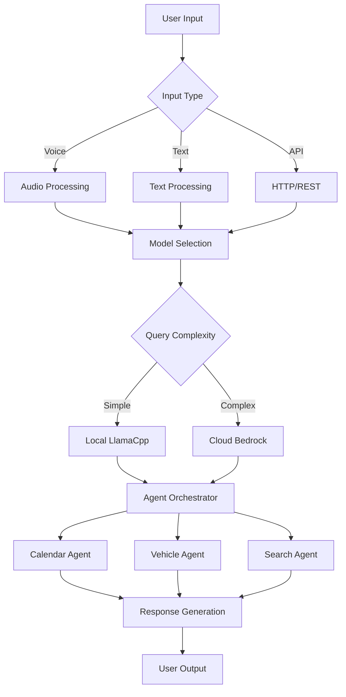
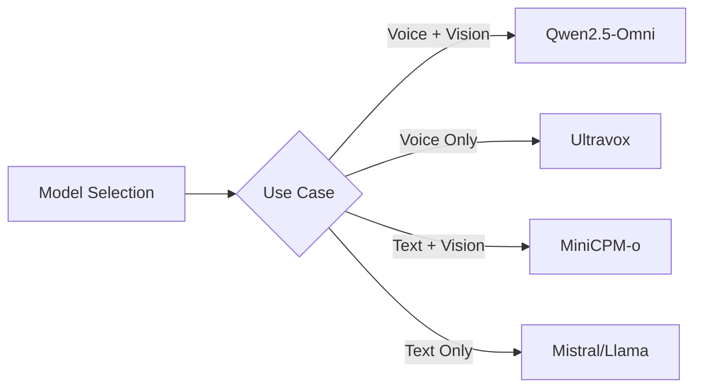
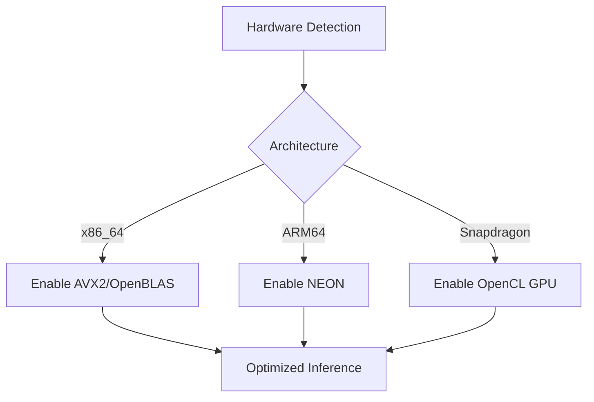

# Edge Deployment for Agentic AI

Production-ready containerized deployment of the multimodal AI assistant optimized for edge computing environments.

## Overview

This edge deployment packages the complete AI assistant into a single, self-contained container that runs efficiently on resource-constrained devices. The system features voice input capabilities, multi-agent orchestration, and automatic hardware optimization across multiple architectures.

### Key Features

- **Function-Calling Model**: Fine-tuned Qwen3-1.7B with structured tool use
- **Cockpit Control Agents**: Climate, window, seat, lighting, and drive mode controls
- **Container-Based Whisper**: FFmpeg with Whisper filter for secure transcription
- **Hardware Acceleration**: Automatic optimization for x86_64 and ARM64 platforms
- **API Mode**: RESTful endpoint with transcription and response metadata
- **Offline Operation**: Fully functional without internet connectivity
- **Dynamic Model Routing**: Intelligent switching between local and cloud models

## Architecture



## Quick Start

Deploy the assistant with a single command:

```bash
cd edge
./deployment/setup.sh
```

This script automatically:
1. Detects your hardware architecture
2. Downloads required AI models
3. Builds an optimized container
4. Starts the assistant service
5. Connects to the interactive interface

## System Requirements

### Minimum Specifications
- **Memory**: 4GB RAM (6GB recommended)
- **Storage**: 8GB free space
- **CPU**: 2+ cores (4+ recommended)
- **Docker**: Version 20.10 or newer

### Platform-Specific Performance

| Platform | Architecture | Acceleration | Performance | Power |
|----------|-------------|--------------|-------------|-------|
| Desktop | x86_64 | OpenBLAS | 15-20 tokens/s | 25-40W |
| Server | x86_64 | OpenBLAS | 20-30 tokens/s | 40-60W |
| Raspberry Pi 5 | ARM64 | NEON | 3-5 tokens/s | 8-12W |
| Snapdragon 8 Gen 3 | ARM64 | Adreno GPU | 10-15 tokens/s | 5-8W |

## Deployment Options

### Standard Deployment
```bash
# Build and run with automatic architecture detection
./deployment/setup.sh
```

### Custom Architecture Build
```bash
# x86_64 systems
docker build -f deployment/Dockerfile.edge -t agentic-ai:x86 .

# ARM64 systems (Raspberry Pi, Apple Silicon)
docker buildx build --platform linux/arm64 -f deployment/Dockerfile.edge -t agentic-ai:arm64 .

# Qualcomm Snapdragon with GPU acceleration
docker buildx build --platform linux/arm64 \
  --build-arg ENABLE_OPENCL=true \
  -f deployment/Dockerfile.edge -t agentic-ai:snapdragon .
```

## Usage

### Interactive Mode (Default)
```bash
# Connect to running container
docker exec -it strands-edge-personal-assistant python /app/main.py

# Example interaction
USER: Schedule a meeting tomorrow at 2pm
ASSISTANT: I'll help you schedule that meeting...

USER: voice
[Recording for 10 seconds...]
Voice captured: "What's wrong with my tire pressure sensor?"
ASSISTANT: The tire pressure monitoring system (TPMS) warning...
```

### API Mode (Remote Audio Processing)
```bash
# Start container for model server
docker run -d --name strands-edge-personal-assistant \
  -p 8080:8080 --env-file .env \
  -v $(pwd)/models:/app/models personal-assistant:edge

# Start API server with container-based Whisper
ENABLE_API=true USE_CONTAINER_WHISPER=true python main.py

# Send audio from client (records locally, transcribes on server)
python -m src.utils.audio_cli api --duration 5 --url http://localhost:8000/chat

# Or send pre-recorded audio via API
curl -X POST http://localhost:8000/chat \
  -H "Content-Type: application/json" \
  -d '{
    "prompt": "voice",
    "audio_data": "<base64_encoded_wav>",
    "session_id": "client-123"
  }'
```

Response includes transcription:
```json
{
  "response": "I've set the temperature to 72 degrees.",
  "transcription": "Set temperature to 72",
  "session_id": "client-123"
}
```

### Android Auto Integration Example
```kotlin
// Kotlin example for Android Auto
class CarAssistant {
    suspend fun askAssistant(query: String): String {
        val response = httpClient.post("http://car-system:8000/chat") {
            contentType(ContentType.Application.Json)
            setBody(ChatRequest(prompt = query, session_id = getUserId()))
        }
        return response.body<ChatResponse>().response
    }
}
```

## Configuration

### Environment Variables

Configure the deployment:

```yaml
environment:
  # Model Configuration
  MODEL_PATH: /app/models/qwen2.5-omni-7b.Q4_K_M.gguf
  CONTEXT_SIZE: 8192
  MAX_TOKENS: 2048
  
  # Deployment Mode
  ENABLE_API: true  # Enable REST API for automotive integration
  DEPLOYMENT_TARGET: automotive  # Options: development, edge, automotive
  
  # Cloud Model (Optional - for hybrid mode)
  BEDROCK_MODEL_ID: us.anthropic.claude-3-5-sonnet-20241022-v2:0
  
  # Performance Tuning
  OMP_NUM_THREADS: auto
  
  # Hardware Acceleration (Qualcomm only)
  GGML_OPENCL_DEVICE: 0
```

### Model Selection

The system supports multiple models optimized for different use cases:



## Management

### Container Operations

```bash
# View status
./deployment/setup.sh status

# Monitor logs
./deployment/setup.sh logs

# Stop service
./deployment/setup.sh stop

# Restart service
./deployment/setup.sh restart

# Rebuild container
./deployment/setup.sh rebuild
```

### API Endpoints (When ENABLE_API=true)

| Endpoint | Method | Description |
|----------|--------|-------------|
| `/health` | GET | System health and capabilities |
| `/chat` | POST | Send chat request with session support |
| `/chat/stream` | POST | Streaming response for real-time feedback |
| `/session/{id}` | DELETE | Clear session to free memory |
| `/docs` | GET | Interactive API documentation |

### Session Management

The API maintains conversation context per session:

```python
# Python client example
import httpx

# Create persistent session
session_id = "driver-123"

# Multiple requests maintain context
response1 = httpx.post(f"http://localhost:8000/chat",
    json={"prompt": "My check engine light is on", "session_id": session_id})

response2 = httpx.post(f"http://localhost:8000/chat",
    json={"prompt": "What should I do about it?", "session_id": session_id})
# Assistant remembers the context about check engine light
```

### Health Monitoring

The container includes automatic health checks and recovery:

```yaml
healthcheck:
  test: ["CMD", "curl", "-f", "http://localhost:8080/health"]
  interval: 30s
  timeout: 10s
  retries: 3
```

## Troubleshooting

### Container Startup Issues

Check system resources and logs:
```bash
# Verify Docker daemon
docker info

# Check container logs
docker logs strands-edge-assistant

# Verify disk space
df -h

# Check memory availability
free -h
```

### Performance Optimization

For x86_64 systems:
```bash
# Verify CPU features
cat /proc/cpuinfo | grep -E "avx2|sse4"

# Increase thread count
export OMP_NUM_THREADS=8
```

For ARM64 systems:
```bash
# Check NEON support
cat /proc/cpuinfo | grep Features

# Optimize for memory-constrained devices
export CONTEXT_SIZE=4096
```

### Voice Input Configuration

Ensure proper audio device access:
```bash
# List audio devices
ls /dev/snd/

# Test microphone
arecord -l

# Grant container audio access
docker run --device /dev/snd ...
```

## Security Considerations

- **Non-root Execution**: Container runs as unprivileged user
- **Resource Limits**: CPU and memory constraints enforced
- **Local Processing**: All data processed on-device
- **No External Dependencies**: Fully offline operation after setup

## Advanced Topics

### Custom Model Integration

Add new models by updating the model downloader:
```python
# model_downloader.py
AVAILABLE_MODELS = {
    "custom-model": {
        "url": "https://huggingface.co/...",
        "size": "4.5GB",
        "features": ["text", "voice"]
    }
}
```

### Hardware-Specific Optimization

The container automatically detects and optimizes for available hardware:



## Contributing

Contributions are welcome. Please ensure:
- Code follows Python PEP 8 standards
- Tests pass on target architectures
- Documentation is updated
- Performance impact is measured

## License

This project is part of the Strands SDK samples collection. See the main repository for license details.